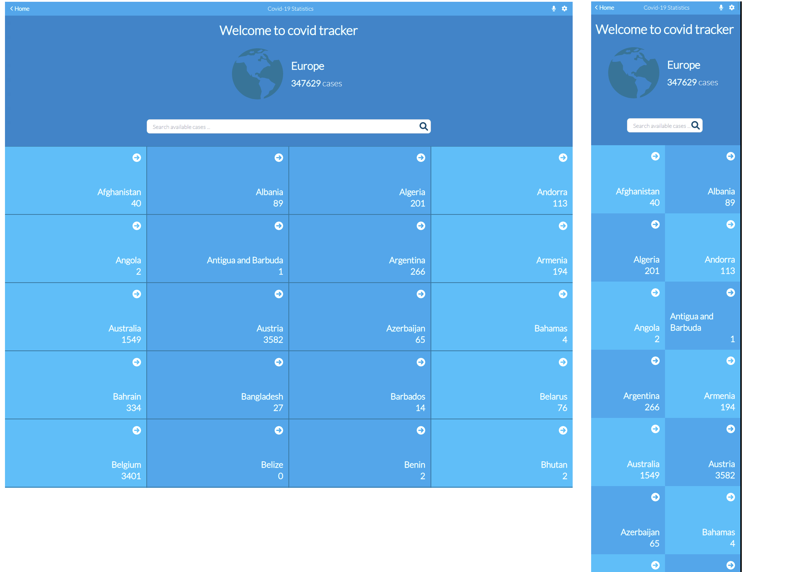
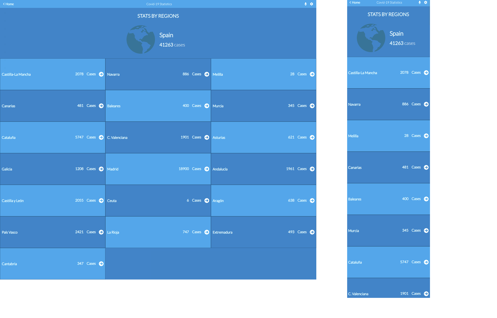

# Module3-capstone

> **COVID-19 TRACKER WEB APP** is a web app that helps people track all cases of affected people around the world. Each country has a total number of affected people too. But we also have a total number of all cases in the world. Please keep in mind that each country has its own list of regions, and each region has a total number of affected people.

> **The API used for this project is:**

- [NARATIVE API](https://api.covid19tracking.narrativa.com/api/2020-03-22)

## Built With

## Screen shoot 1

## Screen shoot 2

## Getting Started

**Prerequisites:** A Web Browser (preferably FireFox or Chrome)

### **Option 1**

#### Use the live Website

[Space traveller hub](https://space-traveller.netlify.app/dragons)

### **Option 2**

#### Set up your own copy locally

- Clone [the GitHub Repository](https://github.com/mwafrika/Corona-track-app)
- Go to the Project `cd Corona-track-app`
- Run `npm install` to install the _dependencies_ Run `npm start` to run the live server.

## Authors

👤 **Mwafrika Josué**

- GitHub: [@mwafrika](https://github.com/mwafrika)
- Twitter: [@mwafrikamufung1](https://twitter.com/mwafrikamufung1)
- LinkedIn: [@mwafrika-mufungizi](https://linkedin.com/in/mwafrika-mufungizi)

## Contributors

Contributions, issues, and feature requests are welcome!

Feel free to check the [issues page](../../issues/).

## Show your support

Give a ⭐️ if you like this project!

## Acknowledgments

- [Nelson Sakwa on Behance](https://www.behance.net/sakwadesignstudio)

## 📝 License

This project is [MIT](./MIT.md) licensed.
